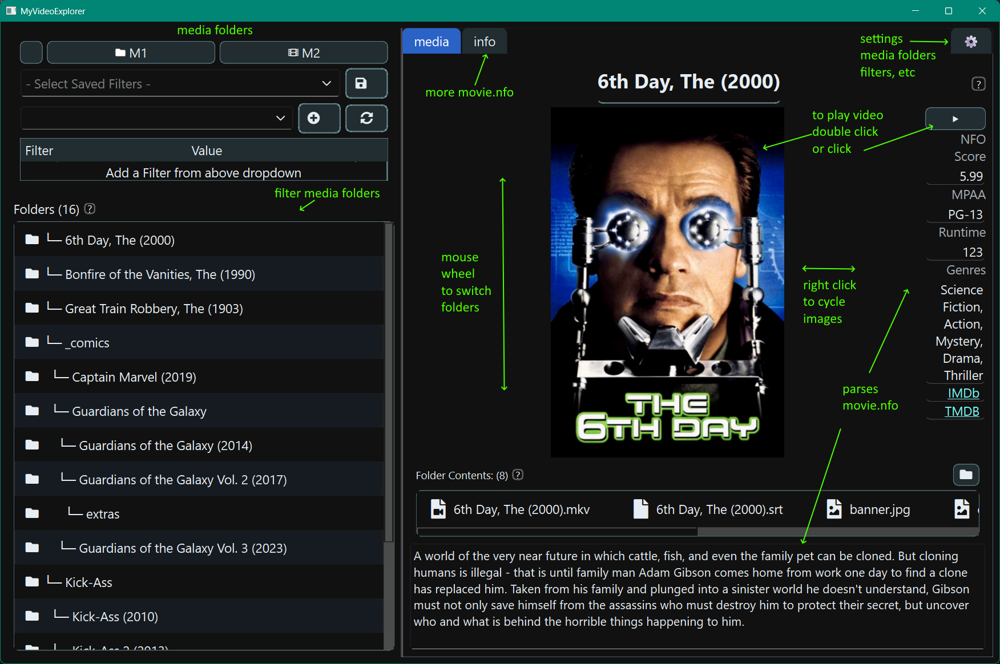

# MyVideoExplorer

_**app is under development**_

features, settings, configs may change without notice and with breaking changes

---

Explore and play ~~your~~ ~~.. my~~ ~~..~~ your videos.

An alternative to **Kodi** or **Plex**, which primarily emphasize poster‑style views of your videos. If you don’t
recognize a poster, you often have to play part of the video or search online just to figure out what the video is.

An alternative to **Windows Explorer**, which focuses on file listings and requires opening each file to see posters or
metadata like movie.nfo.

**MyVideoExplorer** sits comfortably in the middle. It’s a simple, streamlined video browser that lets you scroll
through your collection while displaying enough metadata to quickly decide if it’s the video you want to watch today.

Screenshot:

### Features:

- play videos using the default os video player
- simple play movies by double clicking on poster or play button
- mouse wheel over poster to scroll through video folders
- right click over poster to cycle through current folder images
- basic filtering of folder and files
- filter media folders shown
- basic movie.nfo parsing: plot, mpaa, runtime, genres, imdb id, tmdb id, actors, directors, etc (if nfo files exists
  and xml data is available)
- basic tooltips for inline help
- settings
    - ui font size can be adjusted so text is conformably readable on your tv or projector
    - add multiple media folders if your videos are organized in different drives or folders
    - manage filters

### Wishlist:

- to allow more and faster filtering, scan media folders and build local database
- tags for filtering
- track played count, last played
- add filters for nfo, tags, played
- more ui settings
- play episodes
- ffmpeg info
- export db
- import db backup and compare
- and more

### movie.nfo

Use [Kodi](https://github.com/xbmc/xbmc) or better [MediaElch](https://github.com/komet/mediaelch) to create a movie.nfo
file per video folder.

---

- [changelog.md](doc/changelog.md)

- [development.md](doc/development.md)

---

---
